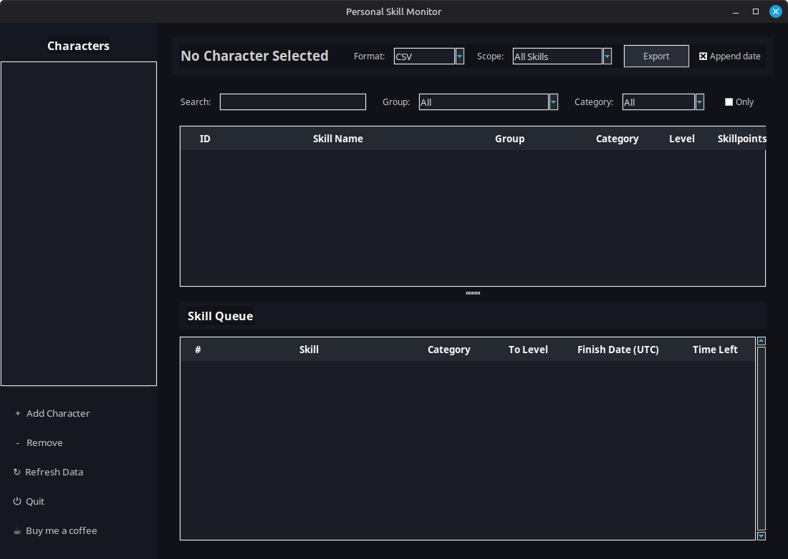
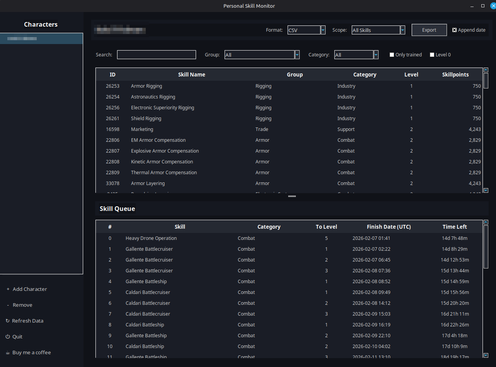

# Personal Skill Monitor








Personal Skill Monitor is a desktop application for EVE Online that displays character skills and the skill queue via EVE ESI/SSO, with convenient filters and multi‑format export.

The app is aimed at capsuleers who want a quick overview of their training without starting the game client or using heavy tools.

***

## Features

- **SSO + Multi‑character**
  - Login via official EVE SSO (OAuth2).
  - Support for multiple characters with easy switching in the sidebar.
  - Refresh tokens stored locally (in `tokens.json`).

- **Skills View**
  - Full list of character skills with:
    - ID, name, group, category, level, skillpoints.
  - Filters:
    - `Search` by skill name.
    - `Group` filter (Gunnery, Drones, Industry, Navigation, etc.).
    - `Category` filter (Combat, Industry, Resource, Support, Other).
    - Checkboxes:
      - `Only trained (level ≥ 1)`
      - `Show level 0 skills`
  - Sorting by any column.

- **Skill Queue View**
  - Display of the active skill queue:
    - Position, skill, category, target level, finish date (UTC), time left.
  - Human‑readable remaining time format (e.g. `3d 4h 12m`).

- **Data export**
  - Export **All Skills**, **Filtered Skills**, or **Skill Queue** to:
    - CSV  
    - JSON  
    - XML  
    - Text (human‑readable list)  
    - Python (list of dicts)  
    - Clipboard (copies data to the system clipboard)
  - `Append date` option — adds `_YYYYMMDD` to the file name.

- **UI**
  - Dark EVE‑style theme.
  - Left sidebar with characters and actions:
    - Add Character
    - Remove
    - Refresh Data
    - Quit
    - Buy me a coffee
  - Responsive layout that works well at common resolutions (1280×720 and above).

***

## Requirements

- **OS:** Linux (tested on Linux Mint; other distributions with Python 3 should work).
- **Python:** 3.10+ (3.12 recommended).
- **Python dependencies:**
  - `requests`
  - `python-dotenv`
  - (any additional dependencies are listed in `requirements.txt`)

- **EVE ESI / SSO:**
  - EVE Developer Application required (if you run from source).
  - Required scopes:
    - `esi-skills.read_skills.v1`
    - `esi-skills.read_skillqueue.v1`

***

## Installation (from source)

### 1. Clone the repository

```bash
git clone https://github.com/YOUR_GITHUB_USERNAME/personal-skill-monitor.git
cd personal-skill-monitor
```

### 2. Create virtual environment and install dependencies

```bash
python3 -m venv .venv
source .venv/bin/activate
pip install --upgrade pip
pip install -r requirements.txt
```

***

## EVE Developer Application setup

If you use **prebuilt releases (AppImage/EXE)** this step may not be necessary.  
To run from source you need your own EVE developer application.

1. Go to https://developers.eveonline.com and create a new **Application**.  
2. Type: `Authentication & API Access`.  
3. In **Callback URL** use, for example:

   ```text
   http://localhost:4916/callback
   ```

   (You can change the port, but it must match the app configuration.)

4. Add scopes:

   ```text
   esi-skills.read_skills.v1
   esi-skills.read_skillqueue.v1
   ```

5. Save the **Client ID** and **Client Secret** – you will put them into `config.env`.

***

## Configuration file `config.env`

A template file `config.example.env` is provided in the repository.  
Create your local config:

```bash
cp config.example.env config.env
```

Edit `config.env`:

```env
EVE_CLIENT_ID=Your Client ID
EVE_CLIENT_SECRET=Your Client Secret
EVE_CALLBACK_URL=http://localhost:4916/callback
EVE_SCOPES=esi-skills.read_skills.v1 esi-skills.read_skillqueue.v1
```

**Important:** `config.env` must stay local and **must not** be committed to Git.  
It is already listed in `.gitignore`.

***

## Running the application

From the project directory:

```bash
source .venv/bin/activate
python3 main.py
```

On first launch:

1. Click **Add Character**.  
2. The browser will open the EVE SSO page — log in and grant access.  
3. After successful authorization the app will:
   - Save tokens to `tokens.json`.  
   - Fetch skills and the skill queue.  
   - Display them in the Skills and Skill Queue tables.

Subsequent launches can reuse saved tokens.  
You can add more characters at any time via **Add Character**.

***

## Project structure (short overview)

```text
personal-skill-monitor/
  main.py                 # Application entry point (GUI)
  esi_client.py           # SSO / ESI logic (tokens, refresh, API calls)
  data/
    skills_db.py          # Full skills dictionary (id → name/group/category)
  gui/
    app.py                # Main window and layout
    skill_view.py         # Skills table + filters
    queue_view.py         # Skill queue table
  utils/
    export.py             # Export to CSV/JSON/XML/Text/Python/Clipboard
  config.example.env      # Configuration template
  requirements.txt
  tokens.json             # Local tokens store (ignored by Git)
  exports/                # Exported files target directory
```

(Exact module names can differ slightly — check the repository tree.)

***

## Prebuilt releases (AppImage / Windows)

Planned:

- **Linux AppImage** — download, `chmod +x`, run.  
- **Windows EXE** — built with `pyinstaller`.

These builds will use a shared EVE developer application configured by the author (Client ID/Secret are **not** stored in the public source).  
Advanced users can still build their own binaries with their own ESI app via `config.env`.

Check the **Releases** section on GitHub.

***

## Security

- All tokens are stored locally in `tokens.json` on your machine.  
- `config.env` contains your own Client ID/Secret and is **never** committed to the repository.  
- The app uses read‑only scopes only:
  - `esi-skills.read_skills.v1`
  - `esi-skills.read_skillqueue.v1`

It is recommended to periodically review authorized applications in your EVE account management and revoke access if you stop using this tool.

***

## Support / Buy me a coffee

If this tool helped you plan your training or saved you some time:

**Buy me a coffee:**  
https://buymeacoffee.com/ifridman

***

## License

This project is licensed under the MIT License.  
See the `LICENSE` file for details.

***

## Disclaimer

Personal Skill Monitor is not an official product of CCP hf.  
EVE Online and all related logos and names are the property of CCP hf.  
Use of the EVE ESI API is subject to CCP’s Third‑Party Policies.