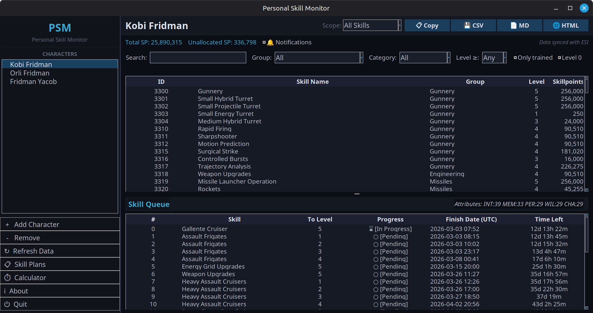
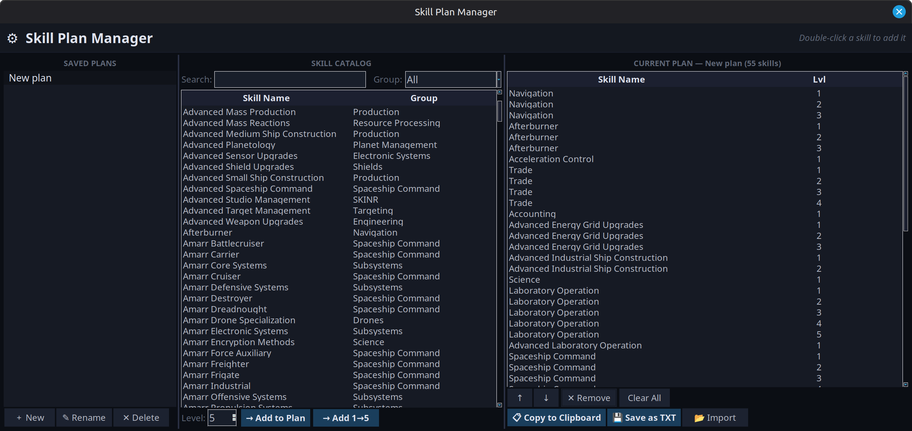
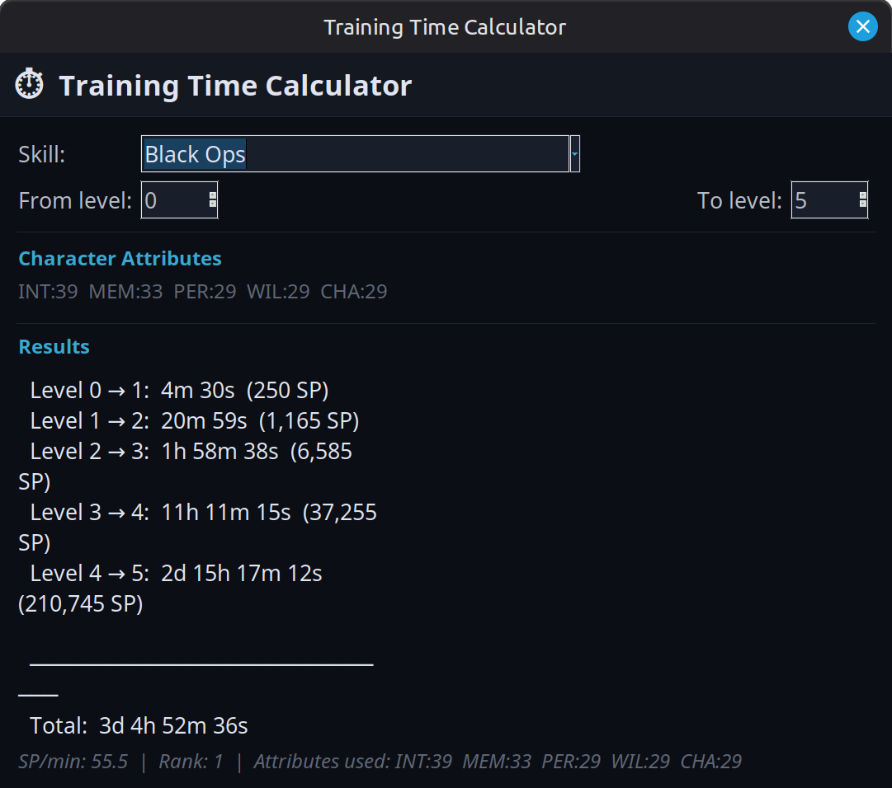

# Personal Skill Monitor







Personal Skill Monitor is a desktop application for EVE Online that displays character skills and the skill queue via EVE ESI/SSO, with convenient filters, multi‑format export, and training time calculations.

The app is aimed at capsuleers who want a quick overview of their training without starting the game client or using heavy tools.

[](https://github.com/Fridman86/Personal-Skill-Monitor/actions/workflows/ci.yml)

***

## What's New in v0.3.1

> **Full changelog:** [CHANGELOG.md](CHANGELOG.md)

- 🔍 **Fuzzy Search** — find skills by partial name (e.g. `"dron"` → `"Drones"`)
- 🎚️ **Level Filter** — show only skills trained to a minimum level (≥ 1 … ≥ 5)
- 📄 **Markdown & HTML Export** — export skill lists as styled documents
- ⏱️ **Training Time Calculator** — estimate training time per level using your character's attributes
- 🔔 **Skill Completion Notifications** — desktop alerts when a skill is about to finish
- 🔁 **ESI Retry Logic** — automatic retries on server errors (429/5xx) with back-off
- 🗕 **System Tray** — minimize to tray instead of closing; restore or quit from tray icon
- 🔄 **Update Checker** — check for new versions on GitHub directly from the app
- 🧪 **51 Unit Tests** — full test coverage for core modules
- ⚙️ **GitHub Actions CI** — automated testing on Python 3.10 / 3.11 / 3.12

***

## Features

- **SSO + Multi‑character**
  - Login via official EVE SSO (OAuth2).
  - Support for multiple characters with easy switching in the sidebar.
  - Automatic token refresh — no need to re-login every 20 minutes.
  - Tokens stored locally in `~/.config/PSM/tokens.json`.

- **Skill Plan Manager**
  - Create and manage custom training plans saved between sessions.
  - **Auto-dependency resolution:** adding a high-level skill automatically adds all required prerequisites in the correct order.
  - Double-click a skill in the catalog to quickly add it to your plan.
  - Export plans to clipboard or `.txt` file; import from clipboard.

- **Skills View**
  - Full list of character skills with: ID, name, group, level, skillpoints.
  - Filters:
    - `Search` — fuzzy/partial name matching (e.g. `"hybrd"` finds `"Large Hybrid Turret"`).
    - `Group` — filter by skill group (Gunnery, Drones, Industry, Navigation, etc.).
    - `Category` — filter by category (Combat, Industry, Resource, Support, Other).
    - `Level ≥` — show only skills trained to a minimum level (Any / 1 / 2 / 3 / 4 / 5).
    - Checkboxes: `Only trained (level ≥ 1)` and `Show level 0 skills`.
  - Sorting by any column (click column header).

- **Skill Queue View**
  - Active skill queue: position, skill name, category, target level, finish date (UTC), time left.
  - Human‑readable remaining time format (e.g. `3d 4h 12m`).
  - Character attribute display (INT / MEM / PER / WIL / CHA).

- **Training Time Calculator** *(New in v0.3.0)*
  - Popup window accessible from the sidebar (`⏱ Calculator`).
  - Select any skill and choose From / To levels.
  - Shows per-level breakdown: time and SP required for each level transition.
  - Displays SP/min rate based on your character's actual attributes.
  - Falls back to default attributes (20 each) if data is not yet loaded.

- **Skill Completion Notifications** *(New in v0.3.0)*
  - Desktop notifications (via system tray) when a skill finishes within 5 minutes.
  - Toggle on/off with the `🔔 Notifications` checkbox in the stats bar.
  - Setting persists across restarts (`ui_settings.json`).

- **System Tray** *(New in v0.3.0)*
  - Clicking the window **✕ close button** minimizes the app to the system tray instead of quitting.
  - A tray icon appears in the taskbar notification area.
  - **Right-click** the tray icon for a context menu:
    - **Show** — restore the main window.
    - **Quit** — fully exit the application.
  - Double-click the tray icon to restore the window.
  - Gracefully disabled if `pystray` / `Pillow` are not installed.

- **Data Export**
  - Export **All Skills**, **Filtered Skills**, or **Skill Queue** to:
    - **CSV** — spreadsheet-compatible.
    - **Markdown** — GitHub-flavoured table, great for wikis and Notion.
    - **HTML** — standalone styled page, open in any browser.
    - **Clipboard** — EVE Online game-importable format (`Skill Name Level`).
  - Save dialog with custom filename and date suffix.

- **Themes**
  - **EVE Dark** (default) — premium dark theme inspired by EVE Online UI.
  - **Dark** — generic dark mode.
  - **Light** — system light theme.
  - Theme selection persists across restarts.

- **Reliability** *(Improved in v0.3.0)*
  - ESI API calls automatically retry on server errors (429, 500, 502, 503, 504).
  - Linear back-off: 5s → 10s → 15s between attempts.
  - All errors logged to `~/.config/PSM/errors.log`.
  - Disk cache used as offline fallback when ESI is unreachable.

***

## Requirements

- **OS:** Linux (tested on Linux Mint; other distributions with Python 3 should work). Windows also supported.
- **Python:** 3.10+ (3.12 recommended).
- **Python dependencies** (installed via `pip install -r requirements.txt`):
  - `requests` — HTTP client for ESI API.
  - `python-dotenv` — loads `config.env`.
  - `rapidfuzz` — fuzzy skill name search.
  - `plyer` — cross-platform desktop notifications.
  - `pystray` — system tray icon.
  - `Pillow` — image handling for tray icon.
  - `pytest`, `pytest-cov` — testing (dev only).

- **EVE ESI / SSO:**
  - EVE Developer Application required (if you run from source).
  - Required scopes:
    - `esi-skills.read_skills.v1`
    - `esi-skills.read_skillqueue.v1`
    - `esi-characters.read_attributes.v1`

***

## Installation (from source)

### 1. Clone the repository

```bash
git clone https://github.com/Fridman86/Personal-Skill-Monitor.git
cd Personal-Skill-Monitor
```

### 2. Create virtual environment and install dependencies

```bash
python3 -m venv .venv
source .venv/bin/activate   # Windows: .venv\Scripts\activate
pip install --upgrade pip
pip install -r requirements.txt
```

### 3. Configure EVE Developer Application

1. Go to https://developers.eveonline.com and create a new **Application**.
2. Type: `Authentication & API Access`.
3. **Callback URL:** `http://localhost:4916/callback`
4. Add scopes:
   ```
   esi-skills.read_skills.v1
   esi-skills.read_skillqueue.v1
   esi-characters.read_attributes.v1
   ```
5. Save the **Client ID** and **Client Secret**.

### 4. Create `config.env`

```bash
cp config.example.env config.env
```

Edit `config.env`:

```env
EVE_CLIENT_ID=Your_Client_ID
EVE_CLIENT_SECRET=Your_Client_Secret
EVE_CALLBACK_URL=http://localhost:4916/callback
EVE_SCOPES=esi-skills.read_skills.v1 esi-skills.read_skillqueue.v1 esi-characters.read_attributes.v1
```

> **Important:** `config.env` must stay local and **must not** be committed to Git. It is already listed in `.gitignore`.

***

## How to Run

### AppImage (Linux)

```bash
chmod +x PersonalSkillMonitor-x86_64.AppImage
./PersonalSkillMonitor-x86_64.AppImage
```

### From Source

```bash
source .venv/bin/activate
python3 main.py
```

On first launch:
1. Click **＋ Add Character** in the sidebar.
2. The browser opens the EVE SSO page — log in and grant access.
3. After authorization the app fetches skills and the queue automatically.

You can add multiple characters and switch between them in the sidebar.

***

## Running Tests

```bash
source .venv/bin/activate
PYTHONPATH=. pytest tests/ -v
```

Current test coverage: **51 tests** across `calculator`, `export`, and `esi` modules.

***

## Project Structure

```text
Personal-Skill-Monitor/
├── main.py                          # Entry point
├── config.env                       # Local config (not committed)
├── config.example.env               # Config template
├── requirements.txt
│
├── src/
│   ├── core/
│   │   ├── auth.py                  # EVE SSO OAuth2 flow
│   │   ├── controller.py            # Business logic, async data refresh
│   │   ├── esi.py                   # ESI API client (retry, cache, token refresh)
│   │   └── notifications.py         # Skill completion notification monitor
│   │
│   ├── data/
│   │   ├── skills_db.py             # Full EVE skill dictionary (id → name/group/category)
│   │   ├── skill_descriptions.py    # Skill tooltip descriptions
│   │   └── skill_prerequisites.py   # Prerequisite resolution
│   │
│   ├── gui/
│   │   ├── app.py                   # Main window, system tray, update checker, CalcWindow
│   │   └── components/
│   │       ├── skill_view.py        # Skills table + fuzzy search + filters
│   │       ├── queue_view.py        # Skill queue table
│   │       └── skill_plan.py        # Skill Plan Manager window
│   │
│   ├── ui/
│   │   ├── theme_eve.py             # EVE Dark theme definition
│   │   └── tooltip.py               # Tooltip + TreeviewTooltip widgets
│   │
│   └── utils/
│       ├── calculator.py            # Training time formulas (SP/min, rank, format)
│       ├── config.py                # Token management, settings
│       ├── export.py                # CSV / Markdown / HTML / Clipboard export
│       └── paths.py                 # XDG-compliant path management
│
├── tests/
│   ├── test_calculator.py           # 24 tests for training time calculator
│   ├── test_esi.py                  # 9 tests for ESI client (mock HTTP)
│   └── test_export.py               # 18 tests for export formats
│
└── .github/
    └── workflows/
        └── ci.yml                   # GitHub Actions CI (Python 3.10/3.11/3.12)
```

***

## Prebuilt Releases

- **Linux AppImage** — [Download latest](https://github.com/Fridman86/Personal-Skill-Monitor/releases/latest)
- **Windows EXE** — [Download latest](https://github.com/Fridman86/Personal-Skill-Monitor/releases/latest)

***

## Security

- All tokens are stored locally in `~/.config/PSM/tokens.json` on your machine.
- `config.env` contains your own Client ID/Secret and is **never** committed to the repository.
- The app uses **read-only** ESI scopes only — it cannot modify your character in any way.
- Errors are logged locally to `~/.config/PSM/errors.log`.

It is recommended to periodically review authorized applications in your EVE account management and revoke access if you stop using this tool.

***

## Support / Buy me a coffee

If this tool helped you plan your training or saved you some time:

**Buy me a coffee:**
https://buymeacoffee.com/ifridman

***

## Contributing

1. Fork the repository.
2. Create a feature branch: `git checkout -b feature/my-feature`.
3. Make your changes and add tests where applicable.
4. Run the test suite: `PYTHONPATH=. pytest tests/ -v`.
5. Submit a Pull Request with a clear description of your changes.

***

## License

This project is licensed under the MIT License.
See the `LICENSE` file for details.

***

## Disclaimer

Personal Skill Monitor is not an official product of CCP hf.
EVE Online and all related logos and names are the property of CCP hf.
Use of the EVE ESI API is subject to CCP's Third‑Party Policies.